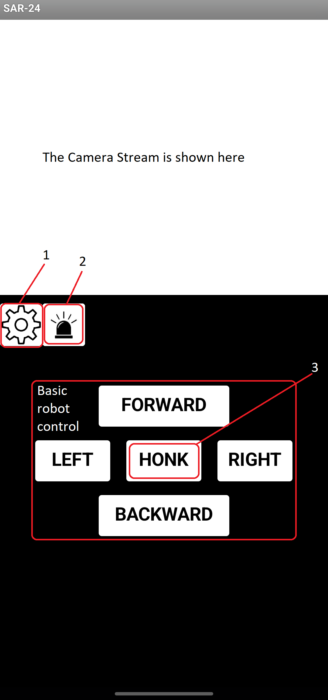
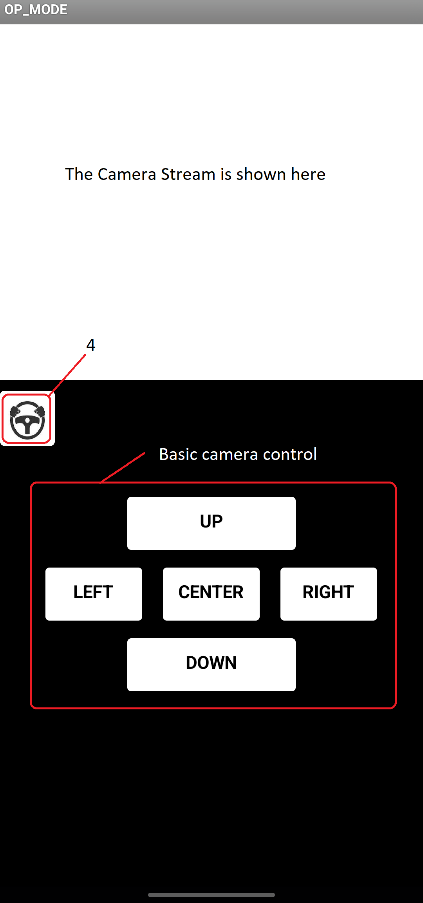

# SAR-24 App

The app is designed for Android devices with WiFi capabilities.
It holds all the functionality that the robot have.

## Functionalities:

Driving Screen:
1.  Switch to Operational Screen
2.  Turn on the siren
3.  Use the Horn on-board

Operational Screen:
4.  Switch to Driving Screen
